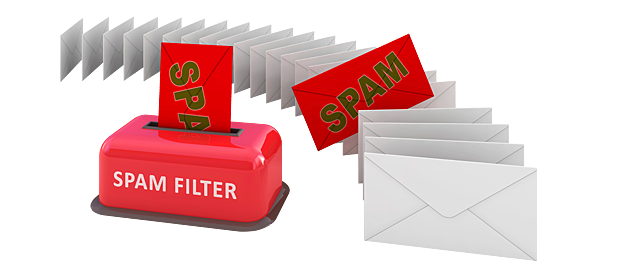

# Spam Message Detector Model 

# Index of contents

1. [Objective](#Objective)
2. [About the data](#About-the-data)
3. [Methods used](#Methods-used) Theory behind Decision-Making Process 🚧
    - [EDA](#EDA)
    - [Cleaning](#Cleaning)
    - [Base Model](#Base-Model) 🚧
      - [Metrics used](#Metrics-used) Theory behind Decision-Making Process 🚧
5. [Experimentation](#Experimentation) 🚧
6. [Technologies](#Technologies) 🚧
7. [Installation](#Installation) 🚧

# Objective

This project presents a step-by-step guide to building an efficient e-mail spam classification model.
By the end of this project, you'll have a powerful tool to help you filter out unwanted e-mails and ensure that your inbox is not filled with unnecessary content.

# About the data
The dataset used for this project can be found [here](https://www.kaggle.com/datasets/mfaisalqureshi/spam-email) which consists of 5,574 messages with the following columns: 

1. ***Category*** column with the following labels:

- HAM: real e-mails we want the filter to land our inbox
- SPAM: spam/scam em-amils that we want to send directly to the spam folder

2. ***Message*** column with a list of messages without any type of format

# Methods used

## EDA
[Notebook](https://github.com/AMaldu/spam_detector/blob/main/notebooks/preprocessing.ipynb)
1. Analysis of basic information about the dataset.
2. Change data types for more memory efficiency and data integrity.
3. Removal of duplicates.
4. Basic viz of features.

## Cleaning
Same notebook as EDA + [Special Replacements Analysis notebook](https://github.com/AMaldu/spam_detector/blob/main/notebooks/special_chars_analysis.ipynb)
1. Replacement of special replacements  
2. Replacement of emojis
3. Conversion to lowecase
4. Removal of HTML tags
5. Removal of URLs
6. Replacement of numbers with "number"
7. Replacement of e-mail addresses with "emailaddr"
8. Removal of punctutation
9. Removal of Non-Alphabetic Characters
10. Collapse of multiple whitespaces into single whitespace

## 

# Experimentation
This section only contains results. If you want to take a look at the Decision-Making Process please take a look at the Experimentation [README file](https://github.com/AMaldu/spam_detector/blob/main/notebooks/experimentation/README.md) 
1. Base model BOW + Multinomial Naive Bayes

Classification Report (Test):
                 
                  precision    recall  f1-score   support

           0       0.99      0.97      0.98       453
           1       0.82      0.95      0.88        63

    accuracy                           0.97       516
    macro avg      0.91      0.96      0.93       516
    weighted avg   0.97      0.97      0.97       516

- Recall 0.95: the model is detecting a 95% of the class 1

- Precision 0.82: lower than we would like to because there is a significative number of False Positives

- F1-score 0.88: decent value but since recall is high and precission not that much there is room for improvement.

# Technologies

- Docker

# Installation

build docker container 

docker build -t mlflow .

run docker container

docker run -p 5000:5000 -v $(pwd)/mlflow_artifacts:/mlflow/artifacts mlflow

# Conclusions

